# Documentação da TADS Store

Projeto desenvolvido para a disciplina de Desenvolvimento Front-End II utilizando React.

**Autor:** Oberdan Covre Gomes  
**Matrícula:** 202502EADS0249

**Deploy:** https://tadsstoreocg.netlify.app/  
**Repositório:** https://github.com/oberdangom35/TADS-store-oberdan

**Tecnologias:**
- React
- React Router
- Context API
- DummyJSON API
- ViaCEP API

---

## 📦 Como realizar a Instalação e Executar o Projeto

```bash
git clone https://github.com/oberdangom35/TADS-store-oberdan.git
cd TADS-store-oberdan
npm install
npm run dev
```

### 🔑 Credenciais de Teste (DummyJSON API)

O sistema utiliza usuários reais da API DummyJSON. Exemplos de credenciais válidas:

| Usuário      | Senha        | Nome Completo    |
| ------------ | ------------ | ---------------- |
| `emilys`     | `emilyspass` | Emily Johnson    |
| `michaelw`   | `michaelwpass` | Michael Williams |
| `sophiab`    | `sophiabpass` | Sophia Brown     |

**Mais usuários disponíveis em:** [DummyJSON Users](https://dummyjson.com/users)


## Requisitos da Atividade Atendidos

| Requisito | Status |
|------------|---------|
| Componentização | ✅ |
| Hooks e API | ✅ |
| Navegação SPA | ✅ |
| Autenticação | ✅ |
| Página 404 | ✅ |
| Login DummyJSON | ✅ Extra |
| Carrinho | ✅ Extra |
| ViaCEP | ✅ Extra |
| Deploy Online | ✅ Extra |
| Responsividade | ✅ Extra |

---

## 1. Tela Inicial (Catálogo)

A tela inicial apresenta:

- Header personalizado com navegação, busca e acesso ao carrininho/login
- Sistema de busca em tempo real
- Carrinho de compras acessível pelo cabeçalho
- Menu de categorias dinâmicas
- Carrossel de produtos em destaque
- Vitrine de produtos com filtros e cards

Os produtos são carregados dinamicamente pela API DummyJSON utilizando `useEffect` e `useState`. A busca e o filtro por categoria são aplicados localmente sobre os dados retornados pela API.

**Imagem:**

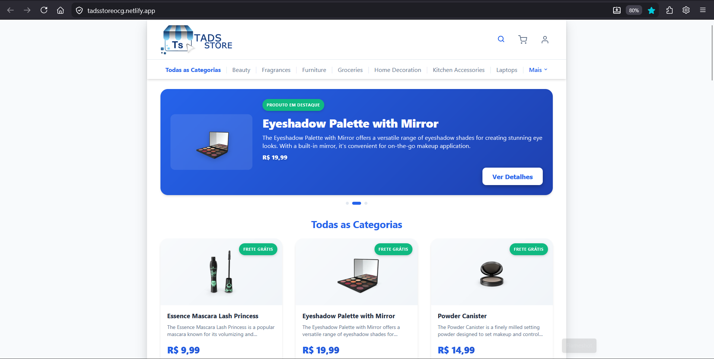

**Menu de categorias:**

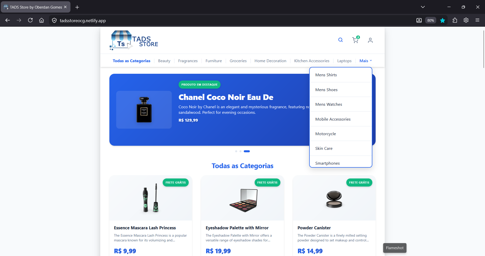

**Resultado de busca:**

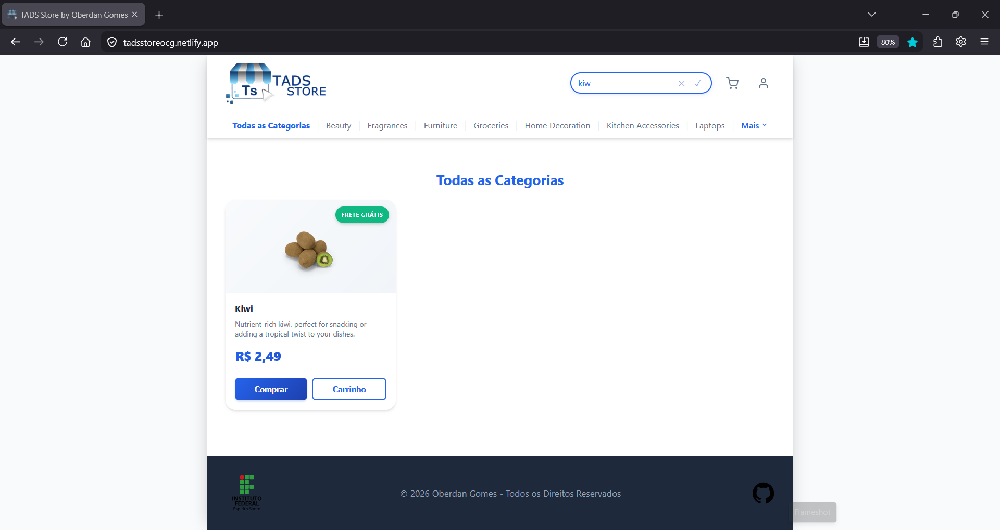

**Resultado de busca quando produto não é encontrado:**

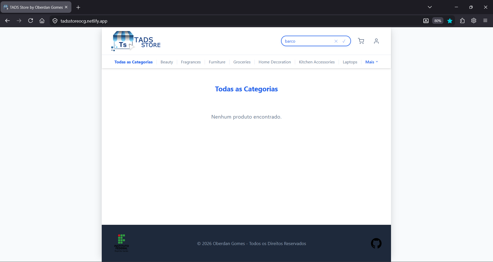

---

## 2. Detalhe do Produto

Ao clicar em um produto da vitrine o sistema navega para a rota:

```
/produto/:id
```

O produto é carregado dinamicamente pela API DummyJSON utilizando o ID informado na URL. A página exibe informações completas, incluindo galeria de imagens, preço, desconto, marca, categoria, dimensões, garantia e avaliações de clientes.

**Imagem:**

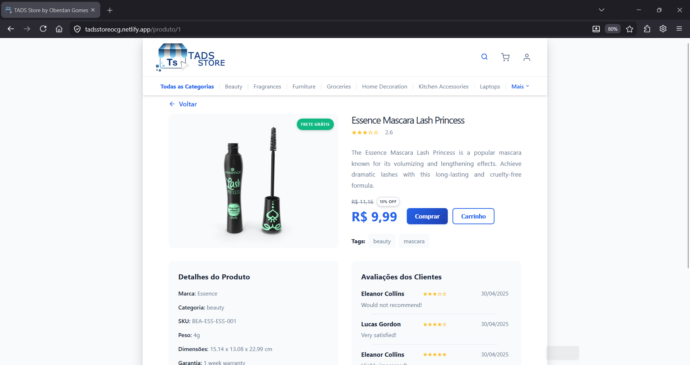

---

## 3. Login e Autenticação

A autenticação utiliza a API DummyJSON através da rota `POST /auth/login`. Após o login, o usuário é armazenado em contexto global através do `AuthContext`. A sessão é persistida no `localStorage` com os tokens de acesso e as informações do usuário, permitindo acesso às áreas protegidas e mantendo o estado entre atualizações de página.

**Imagem:**

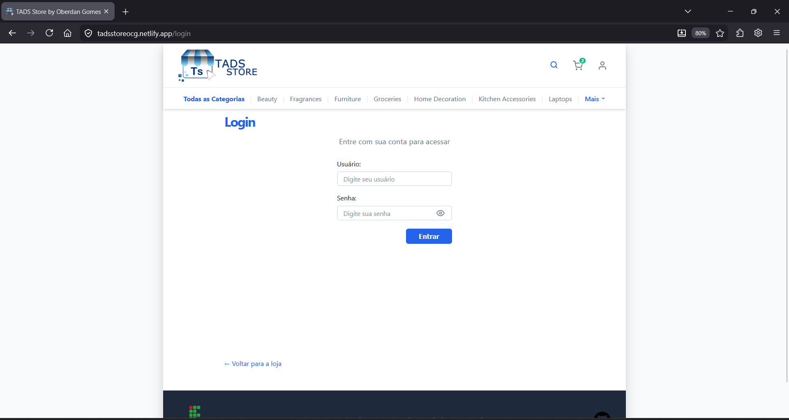

---

## 4. Área Protegida (Minha Conta)

A área Minha Conta somente pode ser acessada por usuários autenticados. Caso o usuário não esteja autenticado, o sistema redireciona automaticamente para a tela de login. A área de conta conta com as páginas Meus Dados, Meus Endereços, Meus Cartões e Meus Pedidos, todas protegidas pelo componente `RotaProtegida`.

**Imagem:**

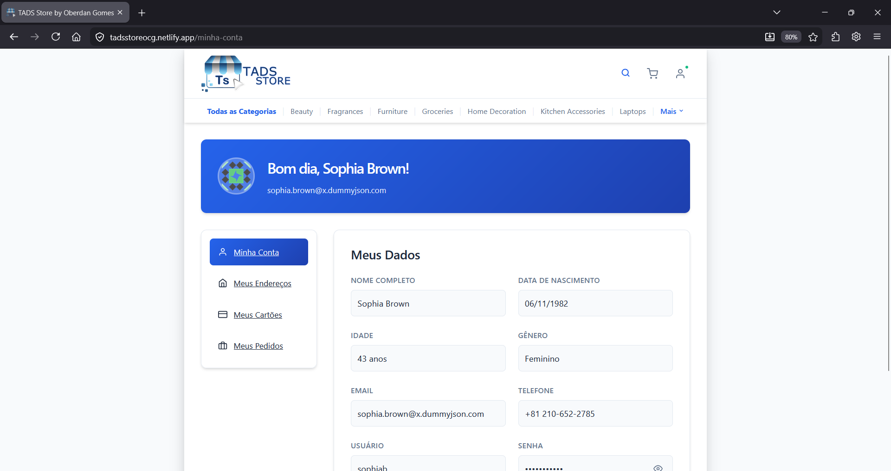

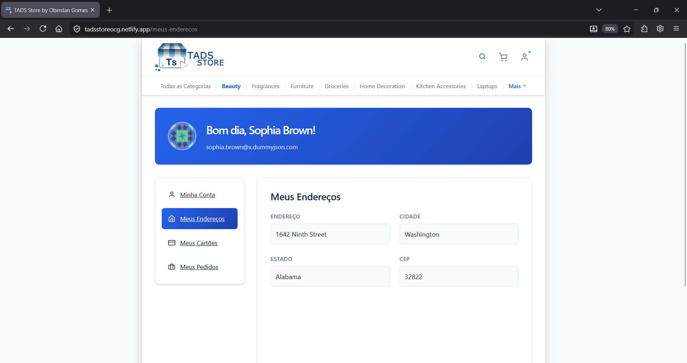

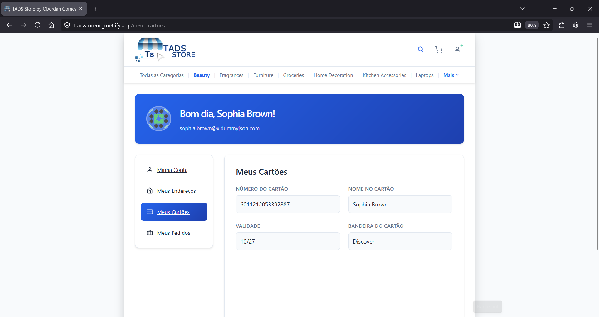


**Dropdown do usuário logado no cabeçalho:**

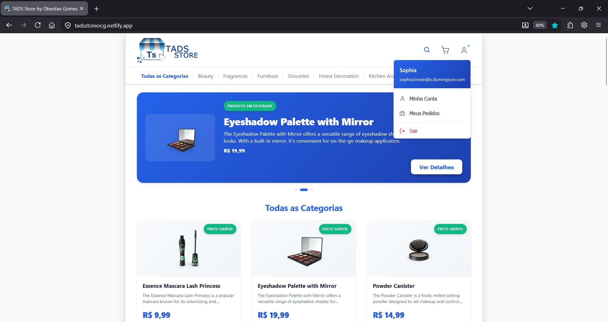

---

## 6. Carrinho e Fluxo de Compra

O sistema possui carrinho persistente permitindo:

- Adicionar produtos
- Remover produtos
- Alterar quantidades
- Calcular subtotal
- Calcular total
- Indicativo de frete grátis

O carrinho utiliza Context API para compartilhamento de estado entre as páginas e persiste os dados no `localStorage` para que os itens não sejam perdidos ao recarregar a aplicação.

**Imagem:**

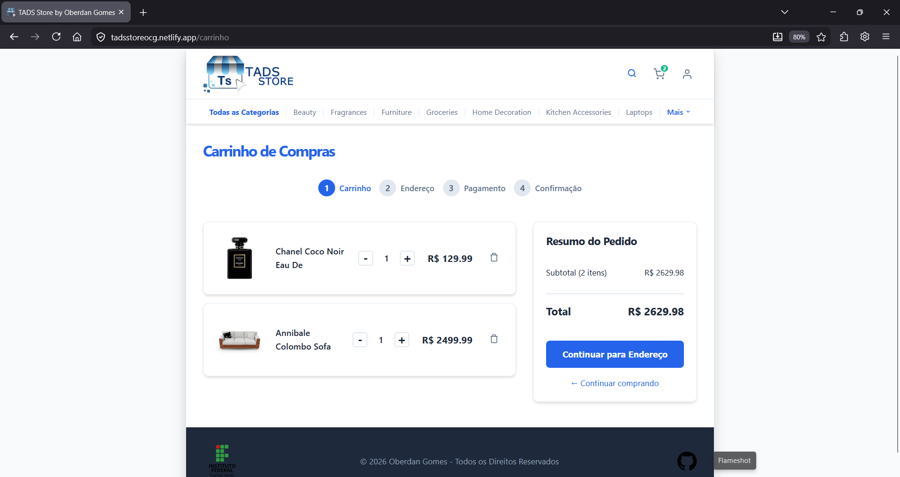

** Caso não haja produtos no carrinho:**
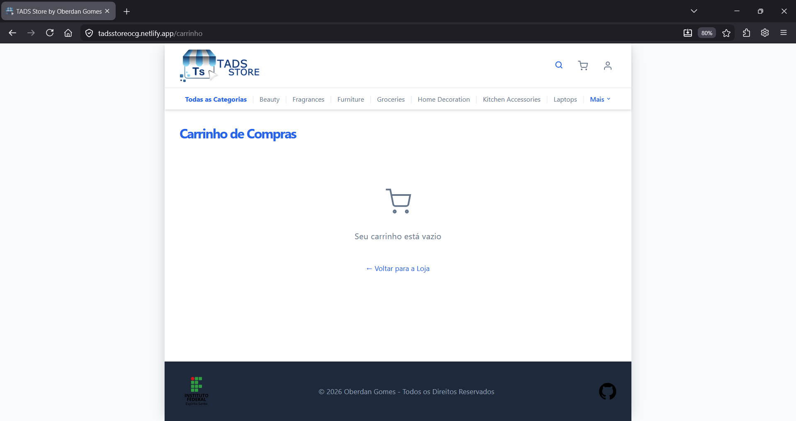

---

## 7. Checkout

Durante o checkout o usuário pode:

- Confirmar os itens e quantidades
- Utilizar o endereço padrão da API DummyJSON ou escolher outro endereço pela API ViaCEP
- Informar os dados de pagamento

Na etapa de endereço, o sistema oferece ainda duas opções: utilizar o endereço padrão carregado automaticamente da API DummyJSON ou informar um novo endereço. Ao digitar o CEP no formulário de outro endereço, o endereço é preenchido automaticamente através da API ViaCEP. A etapa de pagamento utiliza os dados do cartão do usuário logado, trazidos da API DummyJSON, e permite parcelamento em até 10 vezes sem juros.

**Imagem:**

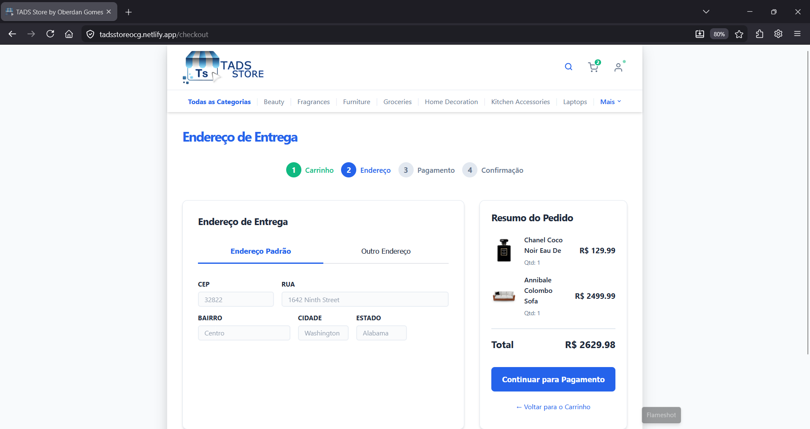

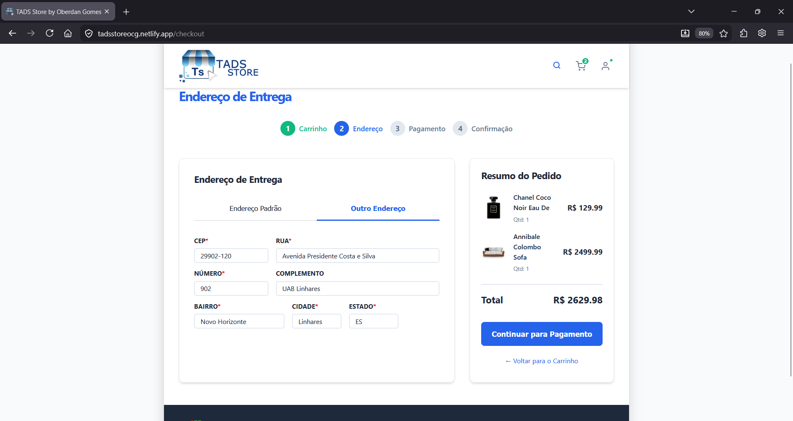

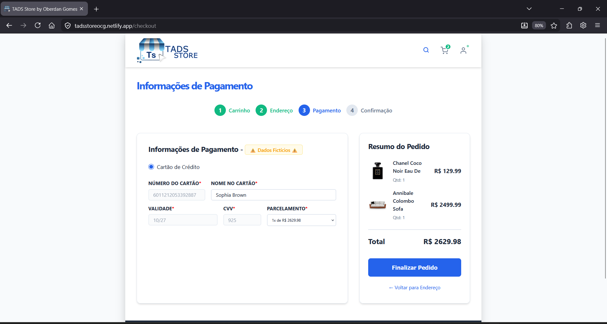

---

## 8. Confirmação de Pedido

Após a finalização do pagamento, o sistema exibe a página de confirmação da compra, apresenta uma mensagem de sucesso, limpa automaticamente o carrinho e oferece um link para a página de Meus Pedidos.

**Imagem:**

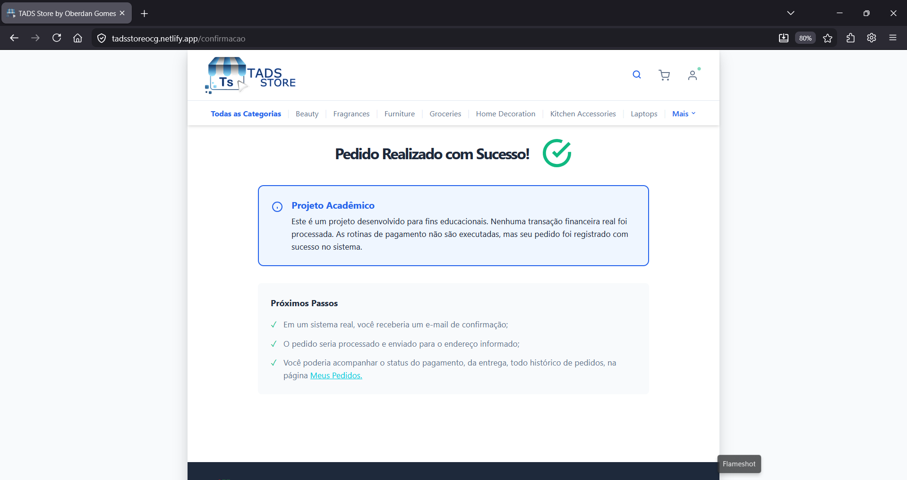

** Navegando para Meus Pedidos:**


---

## 9. Página 404

Quando uma rota inexistente é acessada, o sistema exibe uma página personalizada de erro 404, com uma mensagem amigável e um link para retornar à página inicial.

**Imagem:**

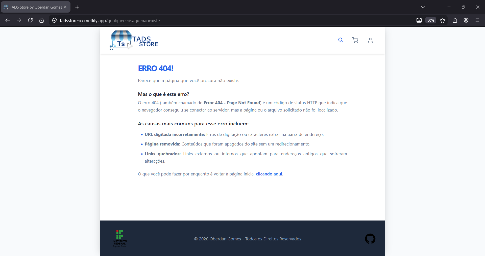

---

## 10. Responsividade (Bônus)

A aplicação foi adaptada para dispositivos móveis utilizando CSS responsivo. O layout se ajusta automaticamente para diferentes tamanhos de tela, reorganizando o menu de categorias, a vitrine de produtos, o cabeçalho e a área de conta.

**Imagens:**

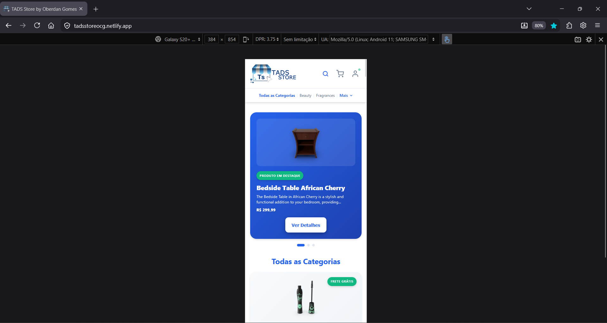

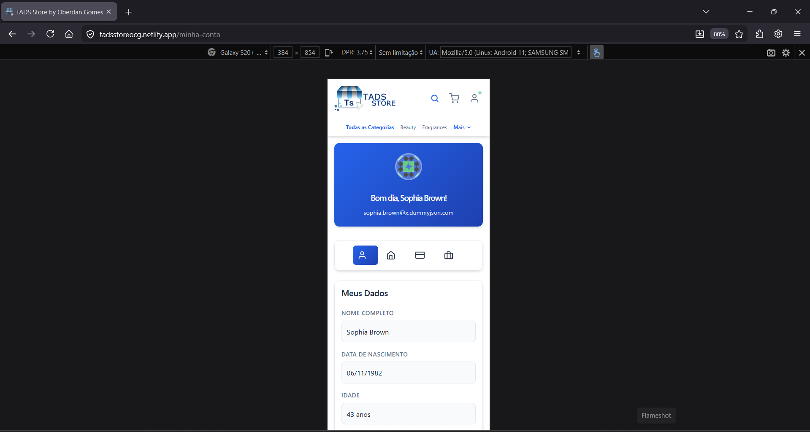

---

## 11. Funcionalidades Extras Implementadas

Além dos requisitos mínimos foram implementados:

- Carrossel de produtos em Destaque
- Login real utilizando DummyJSON
- Carrinho de compras com persistência
- Checkout completo com endereço e pagamento
- Integração ViaCEP para preenchimento automático de endereço
- Persistência de sessão com tokens
- Página de confirmação de pedido
- Responsividade mobile
- Deploy online na Netlify

## 👨‍💻 Desenvolvedor

* **Instituição:** Instituto Federal do Espírito Santo - Campus Alegre
* **Curso:** Tecnologia em Análise e Desenvolvimento de Sistemas - EAD
* **Disciplina:** Desenvolvimento Front End II
* **Aluno:** Oberdan Covre Gomes
* **Matrícula:** 202502EADS0249